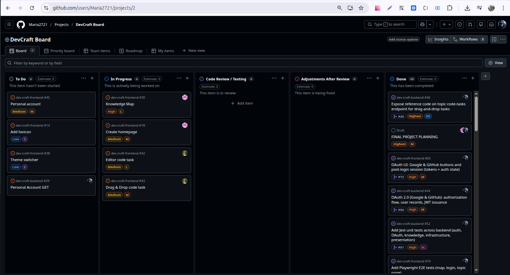

# DevCraft

## About

**DevCraft** is a web application for **preparing for JavaScript and TypeScript technical interviews**, with a focus on **frontend** roles. It is built as a capstone team project: the UI talks to a **REST API** provided by a separate [backend service](https://github.com/Maria2721/dev-craft-backend) for authentication, structured learning content, and other server-driven features.

**Who it is for:** students and developers who want a **guided path**—from topic overview and interview-style questions to practical tasks—instead of a scattered set of links and notes.

**What you can do (product goal):** sign up and sign in, explore a **structured curriculum** (topics, theory, questions, and coding-style assignments), and use tooling that supports learning and practice. The team separates **data served from the API/database** from scenarios where an **AI** layer is appropriate (for example hints or chat-style help), so the experience stays predictable where content is curated and flexible where the model adds value.

**Why it exists:** to give learners one place to rehearse common interview themes, drill theory and code, and build confidence before real interviews.

## What we're proud of

We built a **structured knowledge layer** end to end: interview topics, theory questions, and code tasks live in the database and are served through a clear **REST API**, so the UI and automation always share the same source of truth. Learners can submit **question attempts** and use **AI-assisted checks** on code tasks—so model feedback stays tied to a concrete exercise, not only to open chat.

**Dify** is where we keep the heavy **AI** lifting—chat flows, prompts, and **retrieval over our knowledge base**—while the backend focuses on auth, content, throttling, and passing **task context** (topic, prompt, code snippet) into the model. The same ideas extend to a **Discord bot** that talks to **Dify**, with **speech-to-text** for voice messages and **chunked replies** for long answers, so the assistant is useful outside the browser too.

On the backend we expose an **MCP** server (Model Context Protocol): tools like **topic summary** read the same knowledge data as the app, which fits **AI-assisted workflows** in the IDE. We also publish **OpenAPI** and apply **rate limits** on AI-heavy routes so the surface stays clear and predictable as usage grows.

On the **frontend**, we invested in an **interactive roadmap** (topic graph), focused **topic** pages, **social login** alongside classic auth, and an **in-app AI assistant** that is grounded in what the user is studying—not a generic chat widget.

## Team

<table>
  <tr>
    <td align="center">
      <a href="https://github.com/Maria2721">
        <br/>
        Maria
      </a>
      <br/>
      <a href="https://github.com/Maria2721/dev-craft-frontend/tree/main/development-notes/Maria2721">Development diary</a>
    </td>
    <td align="center">
      <a href="https://github.com/Andrey-Yurchuk">
        <br/>
        Andrey
      </a>
      <br/>
      <a href="https://github.com/Maria2721/dev-craft-frontend/tree/main/development-notes/Andrey-Yurchuk">Development diary</a>
    </td>
    <td align="center">
      <a href="https://github.com/Khabib1802">
        <br/>
        Khabib
      </a>
      <br/>
      <a href="https://github.com/Maria2721/dev-craft-frontend/tree/main/development-notes/Khabib1802">Development diary</a>
    </td>
  </tr>
</table>

## Board

Kanban for tasks and progress: [GitHub Project](https://github.com/users/Maria2721/projects/2)



## Meeting notes

- [2026-02-20 — Project kickoff](meeting-notes/2026-02-20-sync-project-kickoff.md)
- [2026-02-23 — Roadmap and UI](meeting-notes/2026-02-23-sync-roadmap-and-ui.md)
- [2026-03-17 — AI and knowledge base](meeting-notes/2026-03-17-sync-ai-and-knowledge.md)

## Local development

1. **Clone the repository**

   ```bash
   git clone https://github.com/Maria2721/dev-craft-frontend.git
   cd dev-craft-frontend
   ```

2. **Install dependencies**

   ```bash
   npm install
   ```

3. **Environment variables**

   - Copy the example env file and edit values for your machine:

     ```bash
     cp .env.example .env
     ```

   - Set **`VITE_API_URL`** in `.env` to the backend **base URL** (no trailing slash), e.g. `http://localhost:6969` if the API listens there. See the [backend README](https://github.com/Maria2721/dev-craft-backend/blob/main/README.md) for how to run the API and which port it uses.
   - The browser will call the API from the Vite origin; ensure the backend **CORS** settings allow the frontend origin (typically `http://localhost:5173` in development).

4. **Run the dev server**

   ```bash
   npm start
   ```

   Or: `npm run dev` (same command). Then open [http://localhost:5173](http://localhost:5173) (default Vite port).

5. **Production build (optional)**

   ```bash
   npm run build
   npm run preview
   ```

   `preview` serves the built files locally for a quick sanity check before deploy.

## Lint and tests

- **Lint (ESLint):** `npm run lint` — runs ESLint on the project.

- **Unit (Vitest):** `npm run test:run` — runs once in the terminal. Use `npm test` for watch mode, `npm run test:ui` for the Vitest UI.

- **E2E (Playwright):** `npm run test:e2e` — browser tests in `tests/e2e/`. The API must be running (see `VITE_API_URL` in `.env`, typically `http://localhost:6969`). Playwright starts the Vite dev server on `http://localhost:5173` unless it is already up. Optional: `npm run test:e2e:ui` or `npm run test:e2e:headed`. After a run, `npx playwright show-report` opens the HTML report.

Vitest and Playwright scripts are defined on the branch that includes the full test stack (for example **`dev`**). If a command is not found on your checkout, switch to that branch or merge it into your working tree so `package.json` lists the matching scripts.

## Deploy

- https://dev-craft-frontend.netlify.app/

## Demo video

- [DevCraft — demo | Interview prep (JavaScript & TypeScript)](https://youtu.be/yUDCdSWLbUo) (~7 min): main user path, client and backend stack.

## Week 5 proof video

- [Week 5 checkpoint demo](https://youtu.be/oC2j7znBVyA)

## Notable pull requests (code review)

Reviews that dug into behaviour, bundle size, tests, and UX—not just style nits.

| PR | Summary of the review |
|----|------------------------|
| [#51 — Login functionality](https://github.com/Maria2721/dev-craft-frontend/pull/51) | Aligned **tests** with the real login-API flow; flagged **over-strict password rules** on login vs registration; **`autocomplete`** and scope creep in unrelated styles. |
| [#57 — AI Assistant](https://github.com/Maria2721/dev-craft-frontend/pull/57) | **Bundle size** impact of the markdown stack; whether the floating assistant button matches **“authenticated-only”** copy; streaming/error UX. |
| [#70 — Create knowledge map](https://github.com/Maria2721/dev-craft-frontend/pull/70) | **Global vs scoped** `h1` styles on the map; **duplicate topic requests** from nested hooks; **code-splitting** for React Flow and large chunks. |

## Technology Stack


<p align="left">
  
  &nbsp;
  
  &nbsp;
  
  &nbsp;
  
  &nbsp;
  
</p>

**Libraries & tooling:** [Redux Toolkit](https://redux-toolkit.js.org/) + [redux-persist](https://github.com/rt2zz/redux-persist), [axios](https://axios-http.com/) for HTTP, [clsx](https://github.com/lukeed/clsx) for class names, [ESLint](https://eslint.org/) + [Prettier](https://prettier.io/) + [Husky](https://typicode.github.io/husky/) / lint-staged for quality gates
